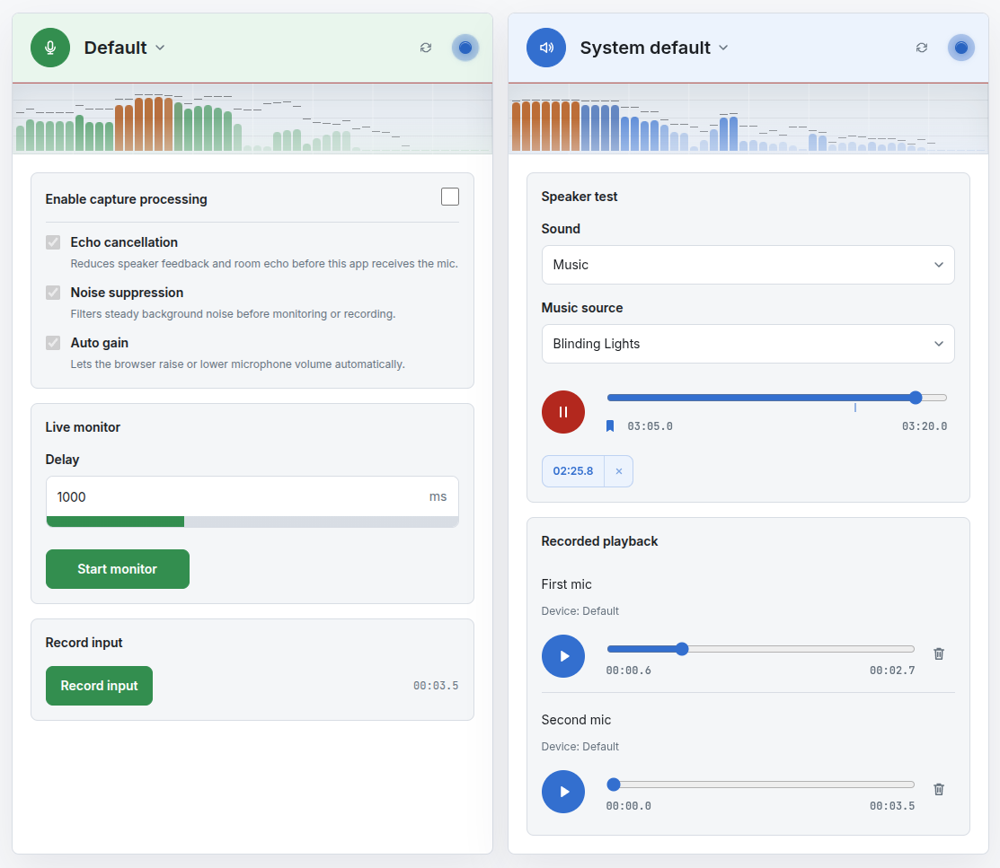

# Sound Check

Browser-based audio checkup for testing microphones, speakers, and device
routing before calls, recordings, or streams.



## Features:

- Test microphone input level and frequency response.
- Play reference sounds or music through selected outputs.
- Monitor input through speaker live, with a delay, or with recordings.
- Inspect browser/device support with built-in debug details.

## iPhone LAN Preview

Phone testing over `192.168.20.18` needs HTTPS for browser audio APIs.

```bash
pnpm cert:phone
pnpm cert:phone:serve
```

On the iPhone, open `http://192.168.20.18:8000/rootCA.pem`. Install the profile
in Settings, then enable it under Certificate Trust Settings. Stop
`pnpm cert:phone:serve` after installing it.

Then run:

```bash
pnpm dev:phone
```

Open `https://192.168.20.18:3000` on the iPhone.

Notes:

- If the PC's LAN IP changes, run `PHONE_CERT_HOST=<new-ip> pnpm cert:phone` and
  use that IP in the iPhone URLs.
- `mkcert` must be on `PATH` on macOS/Linux/Windows. On NixOS, the script can
  fall back to `nix-shell -p mkcert`.
- If Safari still shows a certificate warning, the profile was not fully trusted
  or the cert was regenerated after installing the profile.
